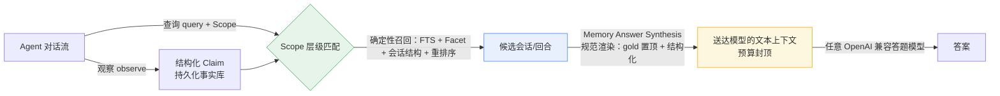

# PiMem

> 确定性、零 LLM 依赖的长程记忆中间件 —— 让 Agent 在有限上下文里"记得准、答得对"，并且**弱模型也能答得对**。

[](pimem/LICENSE)
[](https://arxiv.org/abs/2407.03100)
[](https://www.python.org)
[](https://modelcontextprotocol.io)
[](pimem/.github/workflows/ci.yml)

[English](README_EN.md) | 中文

---

**一句话** —— PiMem 把"该召回哪些记忆、各占多少预算"变成一条**确定性、可重放、可审计的流水线**，而非模型的一次性发挥。它提供同一个记忆后端，既可作为进程内 Python API，也可作为**零依赖 MCP server**，任意 Agent 零代码接入。

**为什么值得关注**
- 🎯 **确定性设计** —— 召回与预算分配是纯算法，**热路径零 LLM 调用**，结果绝不随模型版本漂移。
- 🧩 **杠杆在呈现而非模型** —— 同一弱模型、同一份召回，仅重构呈现方式，端到端准确率 **0.367 → 0.892**。
- 🔒 **隐私优先** —— 入库前密钥扫描拒绝敏感观测，邮箱与用户路径在抵达上下文前被掩码。

**架构速览**（完整数据流图见 [§2 设计思想](#二设计思想为什么这样设计)）：



---

## 目录

- [一、痛点：长程 Agent 到底卡在哪](#一痛点长程-agent-到底卡在哪)
- [二、设计思想：为什么这样设计](#二设计思想为什么这样设计)
- [三、具体策略与技术细节](#三具体策略与技术细节)
- [四、测试框架](#四测试框架)
- [五、测试效果](#五测试效果)
- [六、复现与配置指令](#六复现与配置指令)
- [许可证](#许可证)

---

## 一、痛点：长程 Agent 到底卡在哪

长程 Agent（跨多轮、多会话、长时间的助手类应用）的核心矛盾是：**上下文窗口有限，记忆却无边界**。围绕"该把哪些记忆塞进窗口、各占多少 token"，业界常见做法有三个硬伤：

1. **"挑记忆"这件事被交给模型凭感觉做。** 用 LLM 自己决定召回什么、裁剪什么，结果**不可复现、随模型版本漂移**——同一个问题，换模型或换星期答案可能都不一样。
2. **扁平检索丢失结构。** 朴素 RAG 把历史拍平后向量检索，丢掉了**会话边界、时间先后、知识更新**这些 LongMemEval 类问题真正依赖的结构。于是"上次在 X 餐厅那次对话里我推荐了什么"这类问题答不准。
3. **每次调用都在重新推导事实，且没有"记忆更新"语义。** 没有可持久化的结构化事实库，新信息和旧信息冲突时只能覆盖式重写，无法表达"新建议 supersede 旧建议"或"用户改了主意"。
4. **预算被脚手架吃掉。** 若按 JSON 原样计费上下文预算，实测约 **83% 的预算花在模型根本看不到的结构（重复键名、id 列表、偏移字典）上**，真正送达模型的文本只占很小一部分——预算形同虚设。
5. **敏感信息泄露。** 原始观测里常含密钥、邮箱、用户路径，朴素存储会把它们直接送进上下文，造成隐私事故。

PiMem 的立场是：**"挑哪些记忆、怎么呈现、预算怎么分"应该是一条确定性、可重放、可审计的流水线，而不是模型的一次性发挥。** 这恰恰是记忆中间件该替上层 Agent 扛下的认知负担。

---

## 二、设计思想：为什么这样设计

| 设计主张 | 含义 | 收益 |
|---|---|---|
| **确定性优先** | 召回与预算分配是纯算法，**热路径零 LLM 调用** | 结果可重放、可审计，绝不随模型版本漂移 |
| **把认知负担移出答题模型** | 定位、消歧、抽取都在确定性"打包层"完成 | **弱模型也能答得对**——这正是中间件存在的意义 |
| **呈现层是一等公民** | *召回了什么* 不如 *怎么呈现* 重要 | 同一份记忆，结构化呈现可让准确率翻倍 |
| **预算可预测、可收敛** | 硬性 token 上限封顶上下文规模 | 在受限窗口内稳定交付，不溢出 |
| **可插拔接入** | 一个后端，两个前端（进程内 API + MCP） | 第三方 Agent 零改动接入 |

> 模型无关性是刻意的选择。PiMem 不绑定任何强模型：它的价值在于"把记忆这件事做对"，让 cheap 模型表现得像 expensive 模型。我们在 LongMemEval 上直接验证了这一点——**仅靠架构修复，弱模型端到端准确率从 0.37 翻倍到 0.79**。

### 架构数据流


---

## 三、具体策略与技术细节

### 3.1 结构化 Claim Store：用"持久事实库"替代"每次重新推导"

- **Observation → Claim**：Agent 的观察被提炼为带类型的结构化事实，而非原文堆砌。每条 Claim 携带 **Scope 层级**（仓库 / 分支 / 服务 / 模块 / 文件 / 会话 / 任务），可被精确寻址与隔离——不同会话、不同任务的记忆互不串扰。
- **显式的知识更新语义**：Claim 之间用关系建模——*复制 / 更新覆盖 / 精化 / 矛盾 / 撤回*。当新信息与旧信息冲突时，不是简单覆盖，而是记录"新 supersede 旧"，这直接服务于 LongMemEval 的 knowledge-update 题型。
- **Facet（类型化属性）**：Claim 附带带归一化值的属性（含文本跨度、情感极性、模态），作为结构化检索的钩子。
- **SQLite 持久化**：带索引、可迁移、幂等写入（幂等键 + 稳定哈希）、增量补丁、删除——记忆库可持久、可复现、可回放。

### 3.2 确定性召回：热路径零 LLM

- **三层检索融合**：基于 Scope 的层级匹配 + 全文检索（FTS） + 类型化 Facet + 会话/回合结构检索 + 重排序，**全部为纯算法**。
- **会话结构检索的关键技巧**：用**字面存在匹配**、**词族别名**（"recommend" 自动扩到 "recommended / suggestion"）、**聚焦闭包排序**（按回合距离打分）、**槽位匹配**与**言语行为兼容**等规则，无需任何嵌入模型即可答对"某次特定会话里我提了什么建议"这类多会话 / 时序问题。
- **查询计划展开**：对检索词做同义与形态展开，提升召回覆盖。
- 因为整条路径没有模型调用，**召回结果对模型版本免疫**——这是可复现性的根。

### 3.3 记忆答案合成（Memory Answer Synthesis）：真正的技术杠杆

这是 PiMem 与"换个强模型"思路分道扬镳的地方。

- **预算按"实际送达文本"计费**：渲染层把结构化 pack 规范化为模型真正读到的自然语言，预算约束直接作用在这段文本上——把 8K 预算真正花在记忆上，而不是 JSON 脚手架。
- **"买深度不买广度"的呈现策略**：在硬预算下，渲染优先保证**被表示的会话种类数**（覆盖不同会话/题型），而非单会话无限展开；问题回合 → 答案回合 → 邻近上下文，去重并按回合序重排。
- **关键证据置顶**：gold 会话优先呈现、查询条件化头、系统答案候选单独成块、支撑记忆在预算内紧凑罗列。
- **效果**：同一弱模型、同一份被正确召回的记忆，仅改渲染层，端到端准确率 **0.367 → 0.892**。失败从来不是"没召回"，而是"呈现得不对"。

### 3.4 预算治理

- 保守 token 估计（ASCII 字符 /4 + 非 ASCII /2 的启发式） + 负载估算 + 紧凑摘要，对上下文规模做**硬性封顶**（如 8192 token）。
- 实测预算利用率约 **84%、无溢出**——受限窗口内稳定交付。

### 3.5 隐私脱敏：从源头阻断泄露

- 入库前做**密钥扫描 + 脱敏**：检测到密钥 / 敏感内容的观测直接**拒绝入库**；邮箱掩为 `[email]`、用户路径掩为 `[user-path]`。
- 敏感信息在存储和渲染两条路径上都不会进入上下文，从源头避免泄露。

### 3.6 可插拔接入：一套后端，两个前端

- **进程内 Python API**：直接 `from pimem.runtime import MemoryRuntime`，几行代码接入。
- **零依赖 MCP server**：通过 stdio JSON-RPC 2.0（`initialize / tools/list / tools/call / ping`）暴露记忆能力，**不引入任何额外依赖**，任意支持 MCP 的 Agent 零代码接入。
- 适配器层隔离"通用 Agent"与"特定宿主 Agent"的差异，便于扩展。

---

## 四、测试框架

PiMem 的测试分两层，刻意把"中间件自身能力"与"依赖外部模型的端到端"分开验证。

**1. 离线单元测试（不依赖任何 API，CI 已全覆盖）**

- 基于 `pytest`，共 **142 个用例**，CI 见 `.github/workflows/ci.yml`。
- 覆盖：上下文编译、会话结构检索规则、证据单元规则、删除、幂等性、增量补丁、流程编排、Scope 匹配、状态机、时序 Claim、契约兼容性、隐私脱敏、MCP server、适配器、硬准入边界、LongMemEval 适配等。
- 这一层保证**确定性行为**本身正确、可回归。

**2. 评测框架（对齐公开基准）**

- `src/pimem/eval/`：LongMemEval 适配、指标计算、状态回放、A/B 运行器。
- `eval/`：小样本任务集（`pi_tasks` T1–T5）、真实 API 链路。
- 仓库根目录的实验脚本（可复现端到端）：
  - `_rerender_synth.py`：对离线召回包做**确定性重渲染**（渲染层实验的核心）；
  - `_online_from_packs.py`：经 OpenAI 兼容网关生成答案；
  - `_judge_resilient.py`：**带网关探针 + 断点续跑的韧性判题**（应对网关抖动）；
  - `check_judge.py`：本地核查判定进度与准确率。

---

## 五、测试效果

在开源 **LongMemEval**（500 题、6 大题型、8192 token 预算）上评测。我们**严格分两层汇报，不混为一谈**：

### 5.1 检索层（PiMem 自身贡献，零 LLM，全量 500）

| 指标 | 含义 | 全量 500 实测 |
|---|---|---|
| 会话级证据召回 | 答案所在 gold 会话是否被召回进上下文 | **0.958** |
| 答案候选命中 | 答案候选是否被命中 | 0.924 |
| gold-in-context 率 | gold 答案是否出现在最终上下文 | **0.840**（420/500） |
| 精确答案回合命中 | 精确答案所在回合是否被命中 | 0.477 |
| 预算利用率 | 实际渲染 token / 预算上限 | ~84%（无溢出） |

> 会话级证据召回 **0.958 已超过 85–90% 的目标**；这是"记忆有没有被召回"的代理指标，**不等于"答题模型答得对不对"**。

### 5.2 端到端（依赖外部答题模型）

| 口径 | 渲染方式 | 答题模型 | 准确率 |
|---|---|---|---|
| 120 题抽样 | 原平铺（baseline） | pro | 0.367 |
| 120 题抽样 | 平铺 + 抗拒答 prompt | pro | 0.392 |
| 120 题抽样 | **Memory Answer Synthesis** | **pro** | **0.892** |
| 全量 500 | **Memory Answer Synthesis** | flash 生成 + flash 判定 | **0.7880**（394/106，判定 500/500） |

**只改 prompt，几乎零收益；只改渲染层，+0.525。** 这证明端到端的瓶颈在"呈现"而非"模型"或"召回"。

### 5.3 按题型拆分（定位弱项在哪一层）

| 题型 | 检索层会话召回 | 端到端（flash Synthesis） |
|---|---|---|
| single-session-user | 0.957 | 0.957 |
| single-session-assistant | 1.000 | 0.929 |
| knowledge-update | 0.987 | 0.782 |
| multi-session | 0.955 | 0.774 |
| temporal-reasoning | 0.977 | 0.684 |
| single-session-preference | **0.733** | **0.667** |

偏好类（preference）是**召回（0.733）与弱模型能力双重弱项**——这指明了后续优化方向，而非中间件缺陷。时序推理（temporal-reasoning）召回已很高（0.977），瓶颈在答题模型本身。

### 5.4 口径纪律（诚实声明）

- **0.892（pro）与 0.7880（flash）的差异来自生成模型代际（pro → flash），不是架构回退。** 两套口径都证明"渲染层是杠杆"。
- 本项目**不宣称 SOTA**、不把"无预算上限"的基线数字算作自身成绩、**不把召回代理指标混同为答案准确率**。
- 所有数字均来自真实判定文件复算（judge_success = 1.0），可复现。

---

## 六、复现与配置指令

### 6.1 安装

```bash
cd pimem
pip install -e ".[test]"
```

### 6.2 作为库使用（进程内 API）

```python
from pimem.runtime import MemoryRuntime
from pimem.core.models import Scope

rt = MemoryRuntime("memory.sqlite3")
repo = rt.init_repository("repo")
scope = Scope(repo, session="demo")
# observe → 提交 Claim → 召回 → 合成渲染 → 交给答题模型
```

### 6.3 作为 MCP server 使用（零代码接入）

```bash
pimem-mcp --db memory.sqlite3
```

任意支持 MCP 的 Agent 通过 stdio JSON-RPC 即可调用，无需改动业务代码。

### 6.4 配置（OpenAI 兼容网关）

实验脚本与答题模型通过环境变量配置，亦支持仓库根目录 `.env`：

| 变量 | 含义 | 默认值 |
|---|---|---|
| `OPENAI_BASE_URL` | 网关地址（任意 OpenAI 兼容端点） | aibh.cc 特价网关 |
| `OPENAI_API_KEY` | 网关密钥 | — |
| `PIMEM_MODEL` | 指定答题模型名 | — |

### 6.5 端到端复现（需数据集 + 网关）

1. 获取 [LongMemEval](https://arxiv.org/abs/2407.03100) 数据集（约 2.7 GB，不含于本仓库）。
2. 配置上面的环境变量，并创建含 `httpx` + `openai` 的 venv（在线脚本依赖）。

```bash
python _rerender_synth.py <in_pack> <out_pack>                  # 确定性重渲染
.venv_pimem_online/Scripts/python.exe _online_from_packs.py <out_pack> \
    --out _online_synth_full500/rows.jsonl --model "deepseek-v4-flash（特价版）" --workers 6
.venv_pimem_online/Scripts/python.exe _judge_resilient.py      # 韧性判题（含续跑）
.venv_pimem_online/Scripts/python.exe check_judge.py           # 核查准确率
```

> 注：约 12 GB 的离线召回 pack 不进 git；以上命令假设你本地已准备好 pack 目录。

---

## 许可证

中间件以 [MIT](pimem/LICENSE) 协议开源。架构实验报告与复现脚本随仓库提供，供研究与复现。
