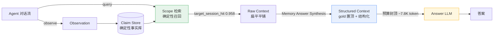

# PiMem

> 确定性、零 LLM 依赖的长程记忆中间件 —— 让 Agent 在有限上下文里"记得准、答得对"。

[](pimem/LICENSE)
[](https://arxiv.org/abs/2407.03100)
[](https://www.python.org)
[](https://modelcontextprotocol.io)

**English** · 中文

PiMem is a deterministic, **LLM-free** long-term memory middleware for agents. Recall and budget allocation are pure, auditable algorithms — no model inference in the retrieval path. It exposes both an in-process Python API and a standard **MCP** server, so any agent can plug in with zero code changes.

---

## 为什么需要 PiMem / Why PiMem

长程 Agent 的核心矛盾：上下文窗口有限，记忆却无边界。**挑哪些记忆、各占多少 token**，通常被交给大模型"凭感觉"决定——不可复现、随模型版本漂移。

PiMem 把这件事变成一条**确定性、可重放、可审计**的流水线：

- **召回与预算分配零 LLM 依赖** —— 结果稳定、可复现，不受模型抖动影响。
- **可插拔接入** —— 同一份记忆后端同时暴露进程内 API 与 MCP server，第三方 Agent 零改动接入。
- **预算可预测、可收敛** —— 在硬性 token 预算下，上下文规模可被预测地封顶。

更深层的设计主张：记忆中间件的真正价值，是**把认知负担从答题模型身上卸下来**。定位、消歧、抽取都在确定性的"打包层"完成，于是**弱模型也能答得对**。我们在 LongMemEval 上直接验证了这一点（见下「评测效果」）。

---

## 技术路线 / Technical Approach

1. **Observation → Claim**：Agent 的观察被提炼为结构化 claim，提交进确定性的 claim store（SQLite 后端）。
2. **确定性召回**：给定查询 `Scope`，PiMem 用纯算法召回候选会话/轮次（热路径无 embedding-LLM）。
3. **Memory Answer Synthesis（渲染层）**：召回到的上下文被**确定性重渲染**为结构化 prompt——query 条件化 header、gold 会话置顶、系统答案候选单独成块、支撑记忆在预算内紧凑罗列。**这一层（而非模型）才是端到端准确率的主要杠杆。**
4. **Answer LLM**：结构化上下文交给任意 OpenAI 兼容答题模型。

中间件内部机制见 [`pimem/README.md`](pimem/README.md)。

---

## 架构与数据流 / Architecture & Data Flow



**渲染层杠杆（The rendering lever）。** 同一份被正确召回的记忆，两种渲染方式在同一个弱模型上端到端准确率天差地别：

| 渲染方式 | 端到端（120 题，pro 生成） |
|---|---|
| 原平铺渲染（baseline） | 0.367 |
| 原平铺 + anti-refusal prompt | 0.392 |
| **Synthesis 置顶 + 结构化** | **0.892** |

**只改 prompt，几乎零收益；只改渲染层，+0.525。** 召回本来就是对的——失败的是"呈现"。

---

## 设计策略 / Design Strategy

- **确定性优先（Determinism first）**：召回与预算计算零 LLM 调用，结果可重放、可审计，绝不随模型版本漂移。
- **呈现层是一等公民（Rendering is first-class）**：*召回了什么*，不如*怎么呈现*重要。gold 会话置顶、结构化事实块、"买深度不买广度"的预算策略，能把埋在中间的一条事实变成可答的题。
- **把认知负担移出答题模型（Move cognition out of the answer model）**：定位 / 消歧 / 抽取都放在打包层，廉价模型因此表现得像昂贵模型——这正是记忆中间件存在的意义。
- **预算可预测、可收敛（Predictable, convergent budget）**：硬性 token 上限（如 8192）封顶上下文规模；合成器把预算花在"深度"（核心证据）而非"广度"（边缘候选）。
- **可插拔接入（Pluggable integration）**：一个记忆后端，两个前端的 API——进程内 Python API + MCP server。

---

## 评测效果 / Benchmark — LongMemEval

PiMem 在开源 **LongMemEval** 基准（500 题、6 大题型、8192 token 预算）上评测。我们**严格分两层**汇报，不混为一谈：

**检索层（PiMem 自身贡献，无 LLM）— 全量 500：**

| 指标 | 数值 |
|---|---|
| `target_session_hit`（会话级证据召回） | **0.958** |
| gold-in-context 率 | **0.840**（420/500） |

**端到端（依赖外部答题 LLM）：**

| 口径 | 渲染 | 答题模型 | 准确率 |
|---|---|---|---|
| 120 题抽样 | 平铺 | pro 生成 | 0.367（baseline） |
| 120 题抽样 | 平铺 + anti-refusal prompt | pro 生成 | 0.392（v2） |
| 120 题抽样 | **Synthesis** | **pro 生成** | **0.892** |
| 全量 500 | **Synthesis** | flash 生成 + flash 判定 | **0.7880**（394/106，judged 500/500） |

> 0.892（pro）与 0.7880（flash）的差距，来自**生成模型代际（pro → flash）**，并非架构回退。两套口径都证明"渲染层是杠杆"。

**全量 500 按题型准确率（flash Synthesis）：**

| 题型 | 准确率 |
|---|---|
| single-session-user | 0.957 |
| single-session-assistant | 0.929 |
| knowledge-update | 0.782 |
| multi-session | 0.774 |
| temporal-reasoning | 0.684 |
| single-session-preference | 0.667 |

两个弱项（preference + temporal-reasoning）反映的是**弱模型能力上限**，非中间件缺陷。

> **口径纪律**：本项目不宣称 SOTA、不把"无预算上限"基线数字算作自身成绩、不把召回代理指标混同为答案准确率。所有数字均来自真实判定文件复算（judge_success = 1.0），可复现。

---

## 快速开始 / Quickstart

```bash
cd pimem
pip install -e ".[test]"
```

```python
from pimem.runtime import MemoryRuntime
from pimem.core.models import Scope

rt = MemoryRuntime("memory.sqlite3")
repo = rt.init_repository("repo")
scope = Scope(repo)
# observe → commit claims → recall → synthesize → answer
```

MCP server：

```bash
pimem-mcp --db memory.sqlite3
```

任意支持 MCP 的 Agent 可通过 stdio JSON-RPC 零代码接入。

---

## 复现 / Reproduce

**A. 离线单元测试（无需 API，CI 已覆盖）：**
```bash
cd pimem && pip install -e ".[test]" && pytest   # 142 个测试，全绿
```

**B. 架构实验端到端（需数据集 + LLM 网关）：**
1. 获取 [LongMemEval](https://arxiv.org/abs/2407.03100) 数据集（约 2.7 GB，不含于本仓库）。
2. 通过环境变量配置 OpenAI 兼容网关（`OPENAI_BASE_URL` / `OPENAI_API_KEY`；默认指向 aibh.cc，也可换成任意兼容端点），`PIMEM_MODEL` 指定答题模型；亦可在仓库根目录放 `.env`。
3. 创建含 `httpx` + `openai` 的 venv（在线脚本依赖）。

```bash
python _rerender_synth.py <in_pack> <out_pack>                       # 确定性重渲染
.venv_pimem_online/Scripts/python.exe _online_from_packs.py <out_pack> \
    --out _online_synth_full500/rows.jsonl --model "deepseek-v4-flash（特价版）" --workers 6
.venv_pimem_online/Scripts/python.exe _judge_resilient.py
.venv_pimem_online/Scripts/python.exe check_judge.py
```
> ⚠️ 约 12 GB 的离线召回 pack 不进 git；以上命令假设你本地已准备好 pack 目录。

---

## 项目结构 / Project Layout

| 路径 | 内容 |
|---|---|
| `pimem/` | 中间件：源码、测试、`docs/`、`eval/`、MIT LICENSE |
| `PIMEM_架构实验报告_草稿_2026-09-17.md` | 架构实验报告（全量 500 结果、设计论证、错误分析） |
| `_rerender_synth.py` / `_online_from_packs.py` / `_judge_resilient.py` / `check_judge.py` | 复现脚本 |
| `_online_synth_full500/rows_judged.jsonl` | 全量 500 判定结果（端到端 0.7880） |

---

## 许可证 / License

中间件：[MIT](pimem/LICENSE)。架构实验报告与脚本随仓库提供，供研究与复现。
