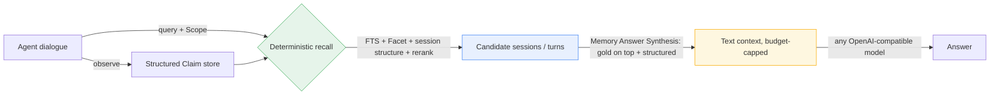
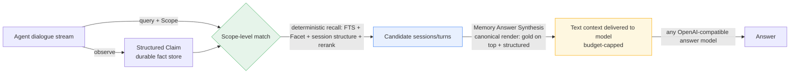

# PiMem

> Deterministic, LLM-free long-term memory middleware for agents — so an agent "remembers accurately and answers correctly" inside a bounded context, **even with a weak model**.

[](pimem/LICENSE)
[](https://arxiv.org/abs/2407.03100)
[](https://www.python.org)
[](https://modelcontextprotocol.io)
[](pimem/.github/workflows/ci.yml)

English | [中文](README.md)

---

**TL;DR** — PiMem turns *"which memories to surface, and how much budget each gets"* into a **deterministic, replayable, auditable pipeline** instead of a one-shot LLM guess. It ships one memory backend exposed both as an in-process Python API and as a **zero-dependency MCP server**, so any agent plugs in with zero code changes.

**Why it matters**
- 🎯 **Deterministic by design** — recall and budget allocation are pure algorithms with **zero LLM on the hot path**, so results never drift across model versions.
- 🧩 **The lever is presentation, not the model** — same weak model, same recall → end-to-end accuracy **0.367 → 0.892** just by restructuring how memory is rendered.
- 🔒 **Privacy by design** — a secret scan rejects sensitive observations at intake; emails and user paths are masked before they ever reach context.

**Architecture at a glance** (full data-flow diagram in [§2 Design Philosophy](#2-design-philosophy)):



---

## Table of Contents

- [1. Pain Points: What Breaks Long-Horizon Agents](#1-pain-points-what-breaks-long-horizon-agents)
- [2. Design Philosophy](#2-design-philosophy)
- [3. Strategy & Technical Details](#3-strategy--technical-details)
- [4. Testing Framework](#4-testing-framework)
- [5. Evaluation Results](#5-evaluation-results)
- [6. Reproduction & Configuration](#6-reproduction--configuration)
- [License](#license)

---

## 1. Pain Points: What Breaks Long-Horizon Agents

The core conflict of long-horizon agents (assistants that span many turns, sessions, and long time spans) is: **a bounded context window against an unbounded memory stream**. Around the question "which memories to surface, and how much budget each gets", the common industry approaches have five hard flaws:

1. **Memory selection is delegated to the LLM "by feel".** Letting the LLM decide what to recall and trim makes results **non-reproducible and drifting across model versions** — the same question may yield different answers on a different model or even a different week.
2. **Flat retrieval loses structure.** Naive RAG flattens history and does vector search, discarding the **session boundaries, temporal order, and knowledge updates** that multi-session / temporal questions actually depend on. So "what did I recommend in that restaurant conversation" gets answered wrong.
3. **Facts are re-derived every call, with no "update" semantics.** Without a durable, structured fact store, new and old information can only be overwritten; there is no way to express "new recommendation supersedes old" or "the user changed their mind".
4. **Budgets are eaten by scaffolding.** If context budget is charged against raw JSON, ~**83%** of it is spent on structures the model never sees (repeated keys, id lists, offset dicts); the text actually delivered is a tiny fraction — the budget is effectively void.
5. **Sensitive data leaks.** Raw observations often contain secrets, emails, and user paths; naive storage feeds them straight into context, causing privacy incidents.

PiMem's stance: **"which memories, how to present them, and how to split the budget" should be a deterministic, replayable, auditable pipeline — not a one-shot LLM guess.** This is precisely the cognitive load a memory middleware should take off the agent's shoulders.

---

## 2. Design Philosophy

| Design Principle | Meaning | Benefit |
|---|---|---|
| **Determinism first** | Recall and budget allocation are pure algorithms, **zero LLM on the hot path** | Results are replayable and auditable; never drift with model versions |
| **Offload cognitive load from the answer model** | Localization, disambiguation, and extraction all happen in the deterministic "packing" layer | **A weak model can still answer correctly** — the whole point of middleware |
| **Presentation is a first-class citizen** | *What was recalled* matters less than *how it is presented* | Same memory, structured presentation can double accuracy |
| **Predictable, convergent budget** | A hard token cap bounds context size | Stable delivery inside a bounded window, no overflow |
| **Pluggable integration** | One backend, two front-ends (in-process API + MCP) | Third-party agents plug in with zero code changes |

> Model-agnosticism is a deliberate choice. PiMem binds to no strong model: its value is "getting memory right" so a cheap model behaves like an expensive one. We validated this directly on LongMemEval — **architecture alone lifted a weak model's end-to-end accuracy from 0.37 to 0.79**.

### Architecture Data Flow



---

## 3. Strategy & Technical Details

### 3.1 Structured Claim Store: a "durable fact store" instead of "re-derive every time"

- **Observation → Claim**: an agent's observations are distilled into typed, structured facts rather than raw text dumps. Each Claim carries a **Scope hierarchy** (repo / branch / service / module / file / session / task) for precise addressing and isolation — memories from different sessions and tasks never cross-contaminate.
- **Explicit knowledge-update semantics**: relations between Claims model *duplicate / supersede / refine / contradict / retract*. When new information conflicts with old, it is not simply overwritten; the system records "new supersedes old", directly serving LongMemEval's knowledge-update questions.
- **Facet (typed attributes)**: Claims carry normalized-value attributes (text spans, sentiment polarity, modality) as hooks for structured retrieval.
- **SQLite persistence**: indexed, migratable, idempotent writes (idempotency keys + stable hashes), incremental patches, deletion — the memory store is durable, reproducible, and replayable.

### 3.2 Deterministic Recall: zero LLM on the hot path

- **Three-layer fusion**: scope-level matching + full-text search (FTS) + typed Facets + session/turn structure retrieval + reranking, **all pure algorithms**.
- **Session-structure retrieval tricks**: literal-presence matching, **word-family aliases** ("recommend" auto-expands to "recommended / suggestion"), **focused-closure ranking** (scored by turn distance), **slot matching**, and **speech-act compatibility** — answering "what did I suggest in that specific session" without any embedding model.
- **Query-plan expansion**: synonym and morphological expansion over retrieval terms improves coverage.
- Because no model call sits on this path, **recall is immune to model versions** — the root of reproducibility.

### 3.3 Memory Answer Synthesis: the real technical lever

This is where PiMem diverges from the "just swap in a stronger model" mindset.

- **Budget is charged on *delivered* text**: the render layer canonicalizes the structured pack into the natural language the model actually reads; the budget constraint acts on that text — spending the 8K budget on memory, not JSON scaffolding.
- **"Buy depth, not breadth" presentation**: under a hard budget, render prioritizes the *number of distinct session types represented* (covering different sessions / question types) over unbounded expansion of a single session; question turn → answer turn → neighboring context, deduped and re-ordered by turn.
- **Key evidence pinned to the top**: gold sessions first, query-conditioned headers, system-answer candidates as their own block, supporting memories listed compactly within budget.
- **Effect**: same weak model, same correctly-recalled memory, changing only the render layer lifts end-to-end accuracy **0.367 → 0.892**. Failure was never "not recalled" but "presented wrong".

### 3.4 Budget Governance

- Conservative token estimation (ASCII char / 4 + non-ASCII / 2 heuristic) + load estimation + compact summary, applying a **hard cap** on context size (e.g. 8192 tokens).
- Measured budget utilization ~**84%, no overflow** — stable delivery inside the bounded window.

### 3.5 Privacy Sanitization: block leaks at the source

- **Secret scan + masking at intake**: observations detected to contain secrets / sensitive content are **rejected from storage**; emails are masked to `[email]`, user paths to `[user-path]`.
- Sensitive data never enters context on either the storage or the render path — leaks are prevented at the source.

### 3.6 Pluggable Integration: one backend, two front-ends

- **In-process Python API**: `from pimem.runtime import MemoryRuntime` — a few lines to integrate.
- **Zero-dependency MCP server**: exposes memory capability via stdio JSON-RPC 2.0 (`initialize / tools/list / tools/call / ping`), **with no extra dependencies**; any MCP-capable agent plugs in with zero code changes.
- An adapter layer isolates "generic agent" from "specific host agent" differences for easy extension.

---

## 4. Testing Framework

PiMem's tests are split into two layers, deliberately separating "the middleware's own capability" from "end-to-end that depends on an external model".

**1. Offline unit tests (no API needed, fully covered by CI)**

- Based on `pytest`, **142 cases**, CI at `.github/workflows/ci.yml`.
- Coverage: context compilation, session-structure retrieval rules, evidence-unit rules, deletion, idempotency, incremental patches, orchestration, Scope matching, state machine, temporal Claims, contract compatibility, privacy sanitization, MCP server, adapters, hard admission boundaries, LongMemEval adaptation, and more.
- This layer guarantees the **deterministic behavior itself** is correct and regressible.

**2. Evaluation framework (aligned with public benchmarks)**

- `src/pimem/eval/`: LongMemEval adaptation, metric computation, state replay, A/B runner.
- `eval/`: small-sample task sets (`pi_tasks` T1–T5), real API paths.
- Reproducible end-to-end scripts at repo root:
  - `_rerender_synth.py`: **deterministic re-render** of offline recall packs (core of the render-layer experiment);
  - `_online_from_packs.py`: answer generation via an OpenAI-compatible gateway;
  - `_judge_resilient.py`: **resilient judging with gateway probing + resume** (handles gateway jitter);
  - `check_judge.py`: local check of judging progress and accuracy.

---

## 5. Evaluation Results

Evaluated on the open-source **LongMemEval** (500 questions, 6 question types, 8192-token budget). We **report the two layers strictly separately, never conflated**:

### 5.1 Retrieval layer (PiMem's own contribution, zero LLM, full 500)

| Metric | Meaning | Full-500 measured |
|---|---|---|
| Session-level evidence recall | Was the gold session containing the answer recalled into context | **0.958** |
| Answer-candidate hit | Was the answer candidate hit | 0.924 |
| gold-in-context rate | Does the gold answer appear in the final context | **0.840** (420/500) |
| Exact answer-turn hit | Was the exact answer turn hit | 0.477 |
| Budget utilization | rendered tokens / budget cap | ~84% (no overflow) |

> Session-level evidence recall **0.958 already exceeds the 85–90% target**; this is a proxy for "was the memory recalled", **not** "did the answer model get it right".

### 5.2 End-to-end (depends on the external answer model)

| Scope | Rendering | Answer model | Accuracy |
|---|---|---|---|
| 120 sampled | flat (baseline) | pro | 0.367 |
| 120 sampled | flat + anti-hallucination prompt | pro | 0.392 |
| 120 sampled | **Memory Answer Synthesis** | **pro** | **0.892** |
| full 500 | **Memory Answer Synthesis** | flash gen + flash judge | **0.7880** (394/106, judged 500/500) |

**Changing only the prompt: ~zero gain. Changing only the render layer: +0.525.** This proves the end-to-end bottleneck is "presentation", not "model" or "recall".

### 5.3 Breakdown by question type (locate the weak layer)

| Type | Retrieval session recall | End-to-end (flash Synthesis) |
|---|---|---|
| single-session-user | 0.957 | 0.957 |
| single-session-assistant | 1.000 | 0.929 |
| knowledge-update | 0.987 | 0.782 |
| multi-session | 0.955 | 0.774 |
| temporal-reasoning | 0.977 | 0.684 |
| single-session-preference | **0.733** | **0.667** |

Preference is a **double weak spot in both recall (0.733) and weak-model capability** — pointing to the next optimization direction, not a middleware defect. Temporal-reasoning recall is already high (0.977); its bottleneck is the answer model itself.

### 5.4 Metric discipline (honest statement)

- **The gap between 0.892 (pro) and 0.7880 (flash) is the generation-model generation (pro → flash), not an architecture regression.** Both scopes prove "the render layer is the lever".
- This project **does not claim SOTA**, does not count "no-budget-cap" baseline numbers as its own achievement, and **does not conflate recall proxies with answer accuracy**.
- All numbers are recomputed from real judged files (judge_success = 1.0) and are reproducible.

---

## 6. Reproduction & Configuration

### 6.1 Install

```bash
cd pimem
pip install -e ".[test]"
```

### 6.2 Use as a library (in-process API)

```python
from pimem.runtime import MemoryRuntime
from pimem.core.models import Scope

rt = MemoryRuntime("memory.sqlite3")
repo = rt.init_repository("repo")
scope = Scope(repo, session="demo")
# observe → submit Claim → recall → synthesis render → hand to answer model
```

### 6.3 Use as an MCP server (zero-code integration)

```bash
pimem-mcp --db memory.sqlite3
```

Any MCP-capable agent can call it over stdio JSON-RPC without touching business code.

### 6.4 Configuration (OpenAI-compatible gateway)

The experiment scripts and answer model are configured via environment variables, also supported via a root `.env`:

| Variable | Meaning | Default |
|---|---|---|
| `OPENAI_BASE_URL` | Gateway URL (any OpenAI-compatible endpoint) | aibh.cc discounted gateway |
| `OPENAI_API_KEY` | Gateway key | — |
| `PIMEM_MODEL` | Answer model name | — |

### 6.5 End-to-end reproduction (needs dataset + gateway)

1. Obtain the [LongMemEval](https://arxiv.org/abs/2407.03100) dataset (~2.7 GB, not in this repo).
2. Configure the env vars above and create a venv with `httpx` + `openai` (online scripts depend on them).

```bash
python _rerender_synth.py <in_pack> <out_pack>                  # deterministic re-render
.venv_pimem_online/Scripts/python.exe _online_from_packs.py <out_pack> \
    --out _online_synth_full500/rows.jsonl --model "deepseek-v4-flash (discounted)" --workers 6
.venv_pimem_online/Scripts/python.exe _judge_resilient.py      # resilient judging (with resume)
.venv_pimem_online/Scripts/python.exe check_judge.py           # check accuracy
```

> Note: the ~12 GB offline recall packs are not in git; the commands above assume you have the pack directory prepared locally.

---

## License

The middleware is open-sourced under the [MIT](pimem/LICENSE) license. The architecture experiment report and reproduction scripts are provided in the repo for research and reproduction. See the Chinese edition [README.md](README.md) for the same content in Chinese.
