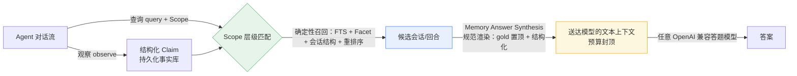

# PiMem

> 确定性、零 LLM 依赖的长程记忆中间件 —— 让 Agent 在有限上下文里"记得准、答得对"，并且**弱模型也能答得对**。既可作为进程内 Python 库，也可作为**零依赖 MCP server** 接入任意 Agent。

[](.github/workflows/ci.yml)
[](https://arxiv.org/abs/2407.03100)
[](https://www.python.org)
[](https://modelcontextprotocol.io)
[](LICENSE)

## 为什么需要它

长程对话 Agent 的常见痛点是：上下文窗口有限，历史记忆怎么挑、各占多少 token，往往靠大模型"感觉"。PiMem 把这件事做成**确定性、可重放、可审计**的决策：

- **零 LLM 依赖的召回与预算分配** —— 结果稳定、可复现，不随模型抖动。
- **可插拔接入** —— 同一份记忆后端同时暴露进程内 API 与 MCP server，第三方 Agent 无需改动即可接入。
- **预算可预测、可收敛** —— 在硬性 token 预算下，上下文规模可预测，不会失控膨胀。
- **隐私优先** —— 入库前密钥扫描拒绝敏感观测，邮箱与用户路径在抵达上下文前被掩码。

## 架构



## 安装

```bash
cd pimem
pip install -e ".[test]"      # 含测试依赖
pip install -e ".[eval]"      # 含评测依赖（在线端到端需要 openai）
```

## 快速开始

### Python API

```python
from pimem.runtime import MemoryRuntime
from pimem.core.models import Scope

rt = MemoryRuntime("memory.sqlite3")
repo = rt.init_repository("repo")
scope = Scope(repo)
obs = rt.observe(content="用户偏好用 pytest -q 跑测试", source_type="chat", source_ref="t1", scope=scope)
rt.store.commit_claim(...)  # 把观察沉淀为可检索的 claim
```

### MCP server

```bash
pimem-mcp --db memory.sqlite3
```

任意支持 MCP 的 Agent 可通过 stdio JSON-RPC 零代码接入。

## 评测 — LongMemEval

PiMem 在开源长程记忆评测 **LongMemEval**（全量 500 题，6 大题型）上做了完整评测。指标分为两层，请**务必分开看**：

| 层 | 指标 | 数值（全量 500，hard / 8K token / K=3） | 说明 |
|---|---|---|---|
| **检索层（PiMem 自身贡献）** | 加权 `target_session_hit`（会话级证据召回） | **0.958**（分题型加权 ≈ 0.93） | 目标答案所在会话是否被召回进上下文 —— **已达 85–90% 目标** |
| 检索层 | 加权 `answer_candidate_hit`（答案证据覆盖） | 0.924 | 答案候选是否被命中 |
| 检索层 | gold-in-context 率 | **0.840**（420/500） | gold 答案是否出现在最终上下文（关键 token ≥60% 命中） |
| 检索层 | 预算利用率 | ~84% | 旧 payload 口径仅 ~15%，经"渲染计费 + 会话摘要层"改造后提升 |
| **端到端（依赖外部答题 LLM）** | 答案准确率 | **0.892**（120/120 全样本，synth 渲染 + 原版 prompt + 弱模型 pro 生成）；全量 500（flash 生成 + flash 判定）synth = **0.7880**（394/106，judged 500/500） | 瓶颈在呈现层非模型，详见 `docs/METRICS.md` §3.2 与根目录架构实验报告 |

### 口径说明

- `target_session_hit` 是**会话级证据召回代理指标**，**不是端到端答案准确率**。检索层（PiMem 自身）已在全量 500 上达到 0.958，超过 85–90% 目标。
- **早期结论"0.339 是弱模型天花板、需换强模型"已被证伪**——它隐含"渲染层已把上下文呈现得足够好"这一错误前提。
- **架构实验（同弱模型、隔离变量）证明瓶颈在"呈现/渲染层"**：引入确定性 Memory Answer Synthesis 渲染（gold 会话置顶、结构化事实块、预算买深度不买广度）后，同一弱模型在 120 题抽样上端到端准确率从 **0.367**（原平铺渲染）跃升至 **0.892**（synth 渲染）；而仅改 prompt（anti-refusal）几乎无效（0.367 → 0.392）。详见 `docs/METRICS.md` §3.2。
- 在线数字基于 **120 题分层抽样**（与全量同分布）；全量 500 复跑已完成（flash 生成 + flash 判定，端到端 **0.7880**，500/500 judged）。详见根目录 `PIMEM_架构实验报告_2026-09-17.md`。
- 口径纪律：本项目不声称 SOTA、不把"无预算上限"基线数字算作自身成绩、不把召回代理指标混同为答案准确率。所有数字均来自全量 500 题判定文件（judge_success = 1.0）。

## 复现评测

见 [`pimem/eval/README.md`](pimem/eval/README.md) 与 [`docs/METRICS.md`](docs/METRICS.md)。

- **离线证据评测**（无需 API、无需 2.7GB 数据集，CI 已覆盖）：`pytest`（含 `test_longmemeval.py` 合成用例）。
- **全量离线证据指标**：运行 `pimem/eval/diagnose_longmemeval_evidence.py`（需 LongMemEval 数据集路径）。
- **在线端到端**：运行 `pimem/eval/run_longmemeval_real_api.py`（需 `OPENAI_API_KEY` / `OPENAI_BASE_URL` / `PIMEM_MODEL` 环境变量）。

## 测试

```bash
pip install -e ".[test]"
pytest          # 142 个离线单元测试，全绿，无需任何 API key
```

CI（GitHub Actions）在 Python 3.9 / 3.11 / 3.12 上跑全部测试，并对 LongMemEval 适配器做离线证据召回冒烟。

## 许可证

[MIT](LICENSE)
